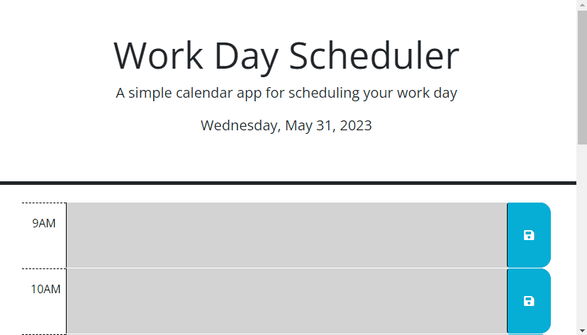

# Work Day Scheduler

## Table of Contents

- [Scope of Work](#scope-of-work)
- [Sample](#sample)
- [Live Website](#live-website)
- [Copyright](#copyright)

## Scope of Work

Modify the Work Day Scheduler starter code to include the following functionality:
- Display the current date in the header of the page.
- Display timeblocks for standard business hours (9AM to 5PM).
- Color code the timeblocks to indicate whether it is in the past, present, or future.
- Clicking on a timeblock will allow the user to enter an event.
- Clicking the save button for a timeblock the text entered for an event is saved to local storage.
- Refreshing the page restores saved events to their timeblock.

## Sample

## Live Website

Browse to https://mycomplex.github.io/wild_shine_deception/ to review.

## Copyright

Provided starter code copyright to its respective owner(s).
